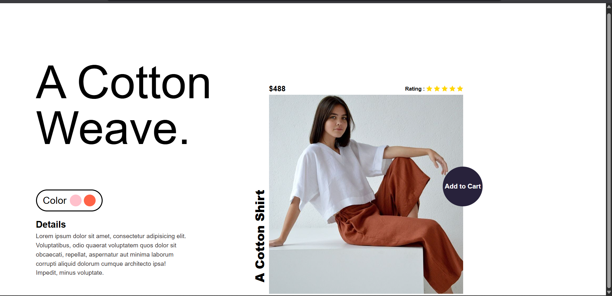

# 👟 A Cotton Weave - Product Page

✨ A modern, responsive product page for a stylish cotton weave outfit, created using only **HTML & CSS**.

---

## 🔖 Badges

---

## 📸 Preview

---

## 🚀 Live Demo

Check out the live demo of this project here:  
https://ayush-raghuwanshi-dev.github.io/A-Cotton-Weave-Project/

---

## 🚀 Key Features

- ✅ **Responsive layout** for all screen sizes
- 🎨 **Color variant** options
- ⭐ **Star rating** section using Remix Icons
- 🛒 **Add to cart** call-to-action
- 🧥 **Clean, minimal design**
- 📱 **Mobile-first CSS media queries**

---

## 🛠️ Tech Stack

 Technology         Purpose                          

 **HTML5**          Page structure                   
 **CSS3**           Styling & responsive layout      
 **Remix Icons**    Product rating (stars)       

---

## 📱 Responsive Design

This page is built with **mobile-first principles** and is optimized for all screen sizes:  
📱 **Mobile**, 💻 **Tablet**, 🖥️ **Desktop**

---

## 👨‍💻 Author

**Ayush Raghuwanshi**  
📍 *B.Tech CSE Student | Passionate Frontend Developer*  
🔗 GitHub: [@Ayush-Raghuwanshi-Dev](https://github.com/Ayush-Raghuwanshi-Dev)

---
---

## 📄 License

This project is licensed under the [MIT License](LICENSE).

